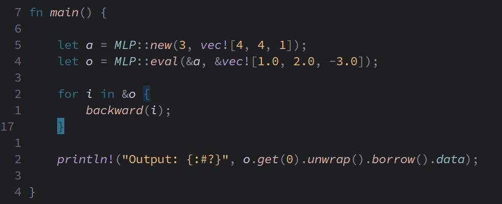

# What is Micrograd?
Andrej karpathy wrote a very interesting and fun project called Micrograd, Which is a tiny Autograd engine.
See it for yourself, It's very neat and clear. [Link to Karpathy's Micrograd](https://github.com/karpathy/micrograd)

## Micrograd-RUST
I was really inspired by karpathy's work and took upon porting Micrograd to Rust as a fun project 
I'll be adding documentation soon.

## MLP MODEL

## In Micrograd

